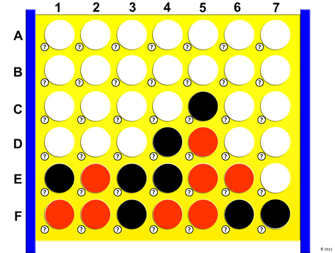

# Connect-Four-Game
Connect Four Game

Rules: Two Players

Rules: Played with Red and Yellow discs

Rules: Two-player connection board game, in which the players choose a color and then take turns dropping colored discs into a seven-column, six-row vertically suspended grid. The pieces fall straight down, occupying the lowest available space within the column. The objective of the game is to be the first to form a horizontal, vertical, or diagonal line of four of one's own discs

Technologies & Code Snippets list of technologies HTML, CSS, Javascript

        
# Are You Smarter Than A 3rd Grader.

Rules: 
2 Players
Game Board is one row of six boxes.
The first to three boxes in a row wins!!

